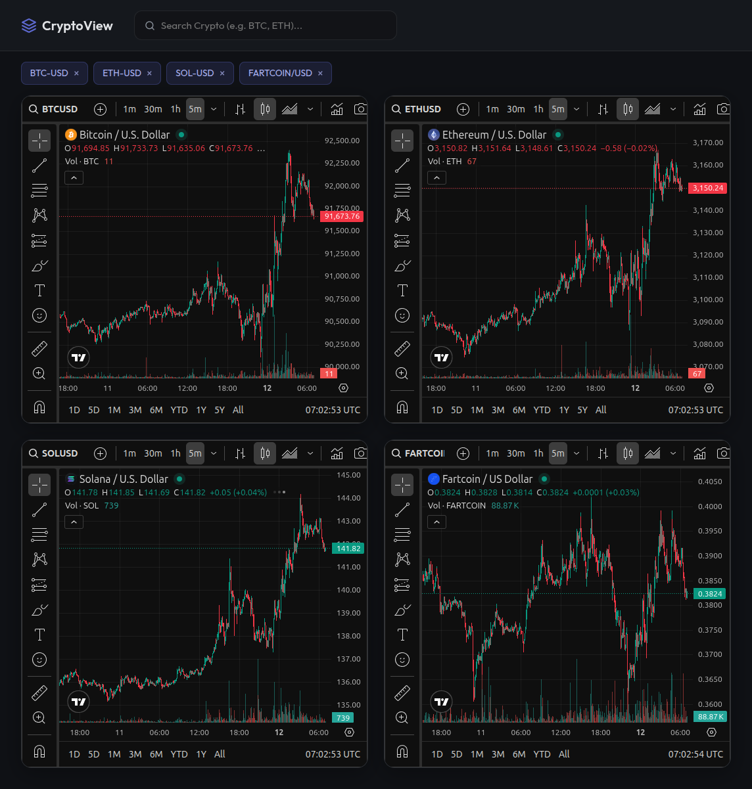

# CryptoView

A cryptocurrency chart viewer powered by the Coinbase API.




## Features

- **Data Integration**: Fetches live trading pairs directly from the Coinbase Public API.
- **Search**: Implements fuzzy search prioritization (Exact Match > Prefix Match > Alphabetical).
- **Interface**: Responsive, dark-themed design with interactive elements.
- **Charts**: Integrated TradingView widgets with a default 5-minute interval.
- **Performance**: Utilizes a pre-generated static `tokens.json` list for efficient initial loading, with API fallback.

## Setup

1. **Clone the repository**:
   ```bash
   git clone <repository-url>
   cd coins
   ```

2. **Serve the application**:
   Due to browser CORS policies regarding local files (for `tokens.json`), the project must be served via a local web server.

   **Using Python**:
   ```bash
   python3 -m http.server
   # Open http://localhost:8000
   ```

   **Using VS Code Live Server**:
   - Install the "Live Server" extension.
   - Right-click `index.html` -> "Open with Live Server".

## Development

- **`generate_tokens.js`**: Node.js script to update the local token list from Coinbase.
  ```bash
  node generate_tokens.js
  ```
- **`api.js`**: Handles data fetching, caching, and search logic.
- **`ui.js`**: Manages the DOM, event listeners, and TradingView chart injection.
- **`style.css`**: Contains styling variables and component styles.

## Technologies

- Vanilla JavaScript (ES6 Modules)
- Coinbase API
- TradingView Lightweight Charts Widget
